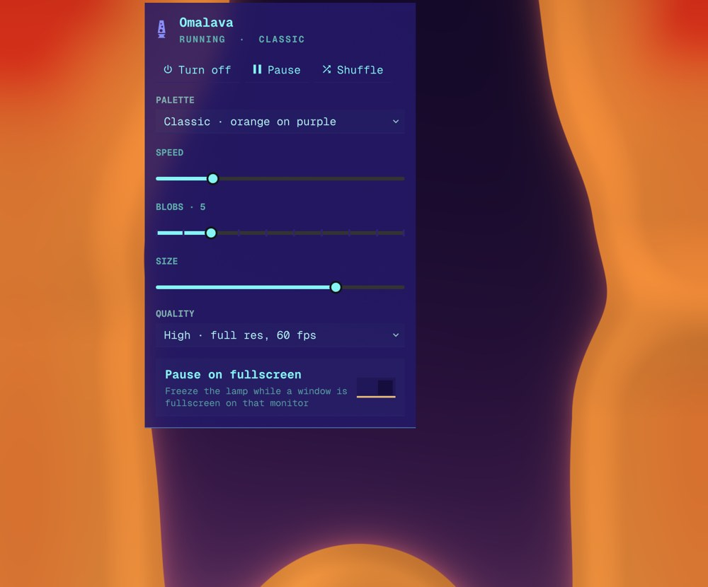
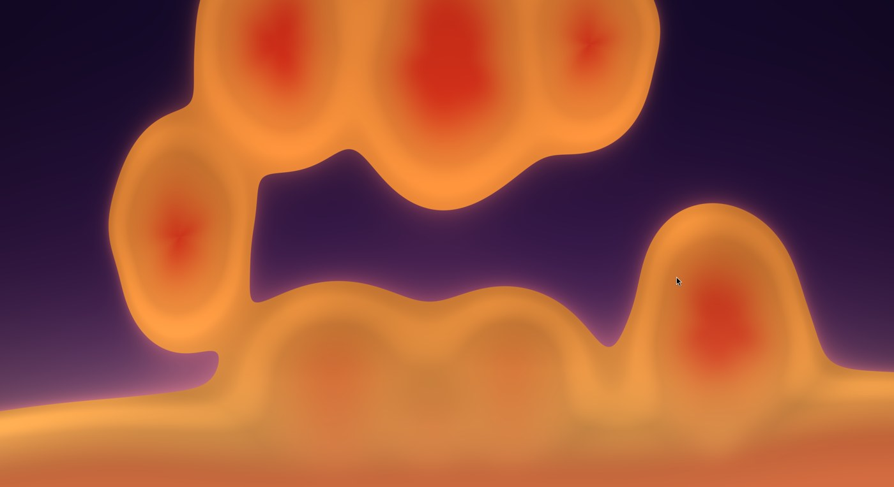
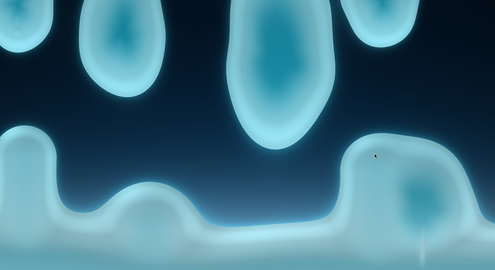
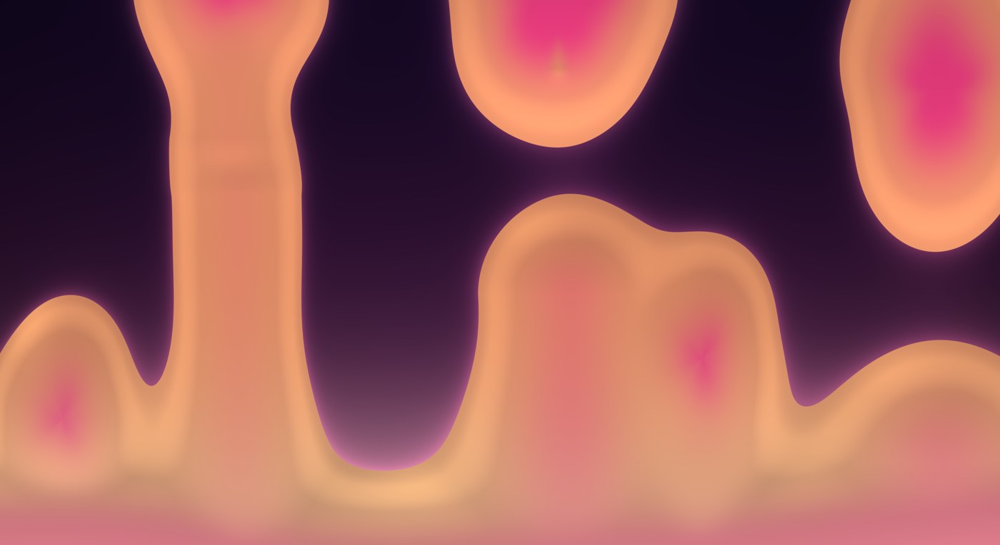
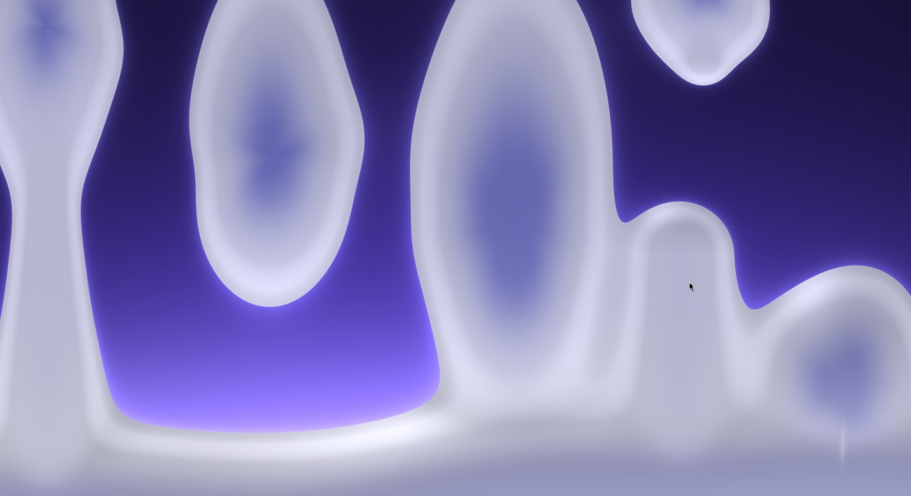

# Omalava

A live liquid motion lamp for your [Omarchy](https://omarchy.org) desktop.
Wax warms on the heater, climbs out of the pool in columns, necks and breaks,
rises, cools under the cap and sinks back — the lava-lamp look, generated on
the fly. There is no video and nothing loops: every run is different, and it
never repeats.


- **Never the same twice.** The wax is simulated, not played back — it starts
  fresh every time and wanders forever.
- **Follows your theme** out of the box, or pick from six palettes.
- **One lamp per monitor**, each doing its own thing.
- **Stays out of your way.** Freezes while a window is fullscreen on that
  monitor; pause it any time; turn it off and your normal wallpaper is back.
- **Light on the machine.** A GPU quality knob; paused or frozen it costs
  nothing.
- **Remembers your settings** across restarts and reboots.

## Install

```bash
omarchy plugin add https://github.com/28allday/omalava
```

Say yes to enabling it and pick a bar section (it suggests the right). A lamp
glyph appears in the bar — click it and turn the lamp on. Right-click the glyph
toggles the lamp without opening the panel.

Update with `omarchy plugin update nosignal.omalava`.

Remove with `omarchy plugin remove nosignal.omalava`. That deletes the plugin;
the only other thing it ever writes is its own settings file,
`~/.local/state/omalava/state.json`, which you can delete too.

### Requirements

Omarchy 4 on Hyprland — nothing else is installed. (The fullscreen watcher
uses `python3` and `hyprctl`, both part of a stock Omarchy.)

## Controls



Everything is in the bar dropdown:

| | |
|---|---|
| **Turn on / off** | Show or hide the lamp. Off means no surface at all — your static wallpaper shows. |
| **Pause / Resume** | Freeze the wax where it is. |
| **Shuffle** | Throw the wax away and start a fresh random population. |
| **Palette** | **Theme** follows Omarchy's accent and background live; **Classic**, **Ocean**, **Acid**, **Sunset**, **Ember**, **Ice** are fixed. |
| **Speed** | 0.25× to 3×. At 1× a blob takes a minute or so to go round. |
| **Blobs** | 3 to 12. Changing it does not reset the lamp — new wax enters from the pool. |
| **Size** | Scales the wax. |
| **Quality** | Low / Medium / High — render scale and frame rate. Medium is what it ships with; Low is the one for a laptop on battery. |
| **Pause on fullscreen** | Freeze the lamp on a monitor while a window is fullscreen there. |

<br clear="all">

## Palettes

| Classic | Ocean |
|---|---|
|  |  |
| **Sunset** | **Theme** (here, a purple Omarchy theme) |
|  |  |

## From a terminal or a keybind

Everything is also reachable through the shell's IPC:

```bash
omarchy-shell omalava on
omarchy-shell omalava off
omarchy-shell omalava toggle
omarchy-shell omalava pause
omarchy-shell omalava resume
omarchy-shell omalava shuffle
omarchy-shell omalava status                 # JSON
omarchy-shell omalava palettes
omarchy-shell omalava setPalette ocean       # theme|classic|ocean|acid|sunset|ember|ice
omarchy-shell omalava setSpeed 0.5           # 0.25 .. 3
omarchy-shell omalava setBlobs 9             # 3 .. 12
omarchy-shell omalava setSize 1.2            # 0.5 .. 1.6
omarchy-shell omalava setQuality low         # low|medium|high
omarchy-shell omalava setPauseOnFullscreen false
```

Out-of-range numbers are clamped; unknown names are ignored.

A keybind, in `~/.config/hypr/bindings.lua`:

```lua
o.bind("SUPER + ALT + L", "Omalava", hl.dsp.exec_cmd("omarchy-shell omalava toggle"))
```

### Shipping defaults in `shell.json`

Settings live in `~/.local/state/omalava/state.json` and are written by the
panel and the IPC calls. If you would rather ship defaults with your config,
an optional `plugins[]` entry is read the first time the plugin starts with
no settings file; every key is optional:

```json
{
  "id": "nosignal.omalava",
  "enabled": true,
  "palette": "classic",
  "speed": 0.75,
  "blobs": 6,
  "size": 1.1,
  "quality": "medium",
  "pauseOnFullscreen": true
}
```

Once a settings file exists it wins.

## What it costs

The lamp is a shader running at the quality level's resolution and frame
rate, plus a small simulation. At Medium on a discrete GPU it is a few percent
of GPU and about three percent of one core; paused, or frozen under a
fullscreen window, it costs nothing. On an integrated GPU or a laptop on
battery, Low is the sensible setting.

## How it works

For the curious: the wax is a metaball field drawn by a GPU shader and moved
by a small physics simulation built on the real laws — buoyancy from thermal
expansion, Stokes drag, Newton cooling, a Bond-number lift-off, Plateau–Rayleigh
pinch-off and capillary retraction. [NOTES.md](NOTES.md) has the details.

## License

MIT.
